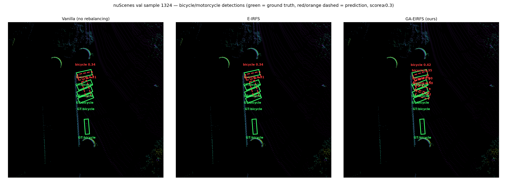

<div align="center">

# GA-EIRFS

### Geometry-Augmented Repeat Factor Sampling for Long-Tailed LiDAR 3D Object Detection

[](LICENSE)
[](#installation)
[](https://github.com/open-mmlab/OpenPCDet)

**[Paper (PDF)]() · [Installation](#installation) · [Dataset Prep](#dataset-preparation) · [Getting Started](#getting-started) · [Results](#results)**

</div>

---

## Introduction

Long-tailed 3D object detection is usually treated as a class-frequency problem: rare classes
get resampled more often, purely based on how rarely they appear. **GA-EIRFS** shows that
frequency alone is not enough, because classes with similar rarity can carry very different
amounts of LiDAR evidence. A bicycle and a trailer can be equally rare in a driving dataset, but
a bicycle returns a handful of LiDAR points while a trailer returns hundreds, simply because of
its size. A rebalancing rule that only counts instances cannot tell these two cases apart.

GA-EIRFS extends [E-IRFS](https://arxiv.org/abs/2503.21893)'s frequency-based repeat factor with
a fixed, class-level **geometric complexity score** ($G_c$), computed once from the training
split's point density, surface-normal entropy, and voxel occupancy. The score modulates the
exponent of the repeat factor, so geometry amplifies an existing frequency-driven need for
exposure rather than acting as an independent difficulty signal. GA-EIRFS is:

- **Detector-agnostic.** It only changes frame-sampling probabilities at the dataloader level.
  The detector architecture, loss function, and inference path are completely untouched.
- **A drop-in sampler for [OpenPCDet](https://github.com/open-mmlab/OpenPCDet),** validated on
  both **CenterPoint** and **PointPillars**.
- **Cheap.** $G_c$ is computed once, offline, before training starts. It costs one pass over
  the annotated point clouds and adds no measurable per-step training overhead.
- **Cross-dataset checked,** validated on nuScenes and transferred to KITTI with the exact same
  hyperparameters, no per-dataset retuning.

<div align="center">


*nuScenes val sample 1324, a cluster of bicycles at bird's-eye view. Green boxes are ground
truth, red dashed boxes are predictions scoring at least 0.3. Vanilla and E-IRFS produce the
same two detections at the same confidence, 0.34 and 0.31, since E-IRFS's frequency-only signal
is not enough to change behavior on its own. GA-EIRFS detects more of the same cluster, at
higher confidence, 0.42 and 0.35 among them, with no change to the detector itself, only to
which frames it was shown more often during training.*
</div>

---

## Installation

GA-EIRFS is a sampler, not a standalone detector. It plugs into
[OpenPCDet](https://github.com/open-mmlab/OpenPCDet), which provides the actual PointPillars and
CenterPoint implementations, the dataloaders, and the training loop.

### 1. Environment

```bash
conda create -n ga-eirfs python=3.8 -y
conda activate ga-eirfs
```

Install PyTorch matching your CUDA version, for example:

```bash
# CUDA 11.8
pip install torch==2.0.1 torchvision==0.15.2 --index-url https://download.pytorch.org/whl/cu118

# CUDA 12.1
pip install torch==2.1.0 torchvision==0.16.0 --index-url https://download.pytorch.org/whl/cu121
```

> Blackwell GPUs: the pins above predate Blackwell entirely. You need a newer
> PyTorch/spconv/CUDA combination that actually supports `sm_120`. See OpenPCDet's own install
> notes for current guidance, this changes faster than either repo's README can track.

### 2. Install OpenPCDet (gives you PointPillars and CenterPoint)

```bash
git clone https://github.com/open-mmlab/OpenPCDet.git
cd OpenPCDet
pip install -r requirements.txt
pip install spconv-cu118   # match your CUDA version, see spconv's own install matrix
python setup.py develop
cd ..
```

### 3. Install this repo

```bash
git clone https://github.com/REPLACE_ME/GA-EIRFS.git
cd GA-EIRFS
pip install -r requirements.txt
pip install -e .
```

### 4. Wire GA-EIRFS into OpenPCDet

GA-EIRFS is not an OpenPCDet plugin system, it is a small, explicit patch to OpenPCDet's own
dataloader construction. Two steps:

**a. Copy the sampler code into OpenPCDet.** Both the nuScenes and KITTI configs import the
sampler from the same path, so this is a single copy regardless of which dataset you use:

```bash
cp ga_eirfs/samplers/*.py OpenPCDet/pcdet/datasets/nuscenes/
```

**b. Add the sampler hook.** Open `OpenPCDet/pcdet/datasets/__init__.py`, find the
`build_dataloader` function, and add the block below as a new `elif` branch, right after the
`if dist:` block and before the final `else: sampler = None`:

```python
    elif training and dataset_cfg.get('USE_GA_EIRFS', False):
        # ── GA-EIRFS ──────────────────────────────────────────────────────────────
        from pcdet.datasets.nuscenes.ga_eirfs_sampler import GAEIRFSSampler3D
        import os
        info_file = dataset_cfg.INFO_PATH['train'][0]
        infos_path = os.path.join(str(dataset.root_path), info_file)
        if logger:
            logger.info(f'[GA-EIRFS] Building sampler from {infos_path}')
        sampler = GAEIRFSSampler3D(
            infos_path=infos_path,
            data_root=str(dataset.root_path),
            threshold=dataset_cfg.get('EIRFS_THRESHOLD', 0.0001),
            alpha=dataset_cfg.get('EIRFS_ALPHA', 2.0),
            beta=dataset_cfg.get('GA_EIRFS_BETA', 1.0),
            geometry_scores_path=dataset_cfg.get('GA_EIRFS_GEOMETRY_SCORES', None),
            seed=seed if seed is not None else 0,
            verbose=True,
        )
        # ── END GA-EIRFS ──────────────────────────────────────────────────────────

    elif training and dataset_cfg.get('USE_EIRFS', False):
        # ── E-IRFS (frequency only, no geometry, useful as an ablation baseline) ──
        from pcdet.datasets.nuscenes.eirfs_sampler import EIRFSSampler3D
        import os
        info_file = dataset_cfg.INFO_PATH['train'][0]
        infos_path = os.path.join(str(dataset.root_path), info_file)
        if logger:
            logger.info(f'[E-IRFS] Building 3D sampler from {infos_path}')
        sampler = EIRFSSampler3D(
            infos_path=infos_path,
            threshold=dataset_cfg.get('EIRFS_THRESHOLD', 0.0001),
            alpha=dataset_cfg.get('EIRFS_ALPHA', 2.0),
            seed=seed if seed is not None else 0,
            verbose=True,
        )
        # ── END E-IRFS ────────────────────────────────────────────────────────────

    else:
        sampler = None
```

That's the entire integration. Nothing else in OpenPCDet needs to change, the sampler only
decides which frame index gets drawn next, everything downstream (augmentation, the model, the
loss, evaluation) is exactly stock OpenPCDet.

**c. Copy the configs.**

```bash
cp configs/nuscenes/*.yaml OpenPCDet/tools/cfgs/nuscenes_models/
cp configs/kitti/*.yaml    OpenPCDet/tools/cfgs/kitti_models/
```

---

## Dataset Preparation

### nuScenes

Download nuScenes (`v1.0-trainval` for the full result, `v1.0-mini` to sanity-check the pipeline
first) from [nuscenes.org](https://www.nuscenes.org/nuscenes) and place it under
`OpenPCDet/data/nuscenes/v1.0-trainval/` following OpenPCDet's own expected layout (`maps/`,
`samples/`, `sweeps/`, and the `v1.0-trainval` metadata folder).

Generate the info files:

```bash
cd OpenPCDet
python -m pcdet.datasets.nuscenes.nuscenes_dataset \
    --func create_nuscenes_infos \
    --cfg_file tools/cfgs/dataset_configs/nuscenes_dataset.yaml \
    --version v1.0-trainval
cd ..
```

This produces `nuscenes_infos_10sweeps_{train,val}.pkl` and the `gt_database/` used by
augmentation. GA-EIRFS reads `nuscenes_infos_10sweeps_train.pkl` directly, no extra adapter step
needed, since nuScenes' native info format already matches what the sampler expects.

### KITTI

Download the KITTI 3D Object Detection benchmark from
[cvlibs.net](http://www.cvlibs.net/datasets/kitti/eval_object.php?obj_benchmark=3d) (velodyne,
label_2, calib, image_2) and extract into `OpenPCDet/data/kitti/`. `ImageSets/{train,val,test}.txt`
ship with OpenPCDet itself.

Generate the standard OpenPCDet infos:

```bash
cd OpenPCDet
python -m pcdet.datasets.kitti.kitti_dataset create_kitti_infos \
    tools/cfgs/dataset_configs/kitti_dataset.yaml
cd ..
```

**KITTI needs one extra step nuScenes doesn't.** KITTI's native info format nests annotations
under `info['annos']` with different field names than nuScenes uses at the top level, and its
point clouds have 4 columns instead of nuScenes' 5. Rather than touch the already-validated
sampler code, `scripts/adapt_kitti_infos.py` produces a second `.pkl` with the extra top-level
fields GA-EIRFS expects, added alongside the originals:

```bash
python scripts/adapt_kitti_infos.py --data_root OpenPCDet/data/kitti --split train
python scripts/adapt_kitti_infos.py --data_root OpenPCDet/data/kitti --split val
```

By default this also filters to the three standard benchmark classes (Car, Pedestrian, Cyclist);
pass `--classes` with no values to keep all 8 raw KITTI label classes if you need them elsewhere.
The KITTI configs in `configs/kitti/` already point `INFO_PATH` at the adapted files, so no
further config changes are needed.

> **A note on KITTI's official evaluation code.** We found that `rotate_iou.py`, the numba-CUDA
> kernel OpenPCDet's KITTI evaluation depends on, silently produces **wrong IoU values** on newer
> numba versions (confirmed on numba 0.67, a box's IoU against itself, which must always be
> exactly 1.0, came out anywhere from 0.0 to 1.0 depending on the box). If you see implausible or
> inconsistent KITTI accuracy numbers, check this first. `patches/kitti_rotate_iou_fix.py` is a
> verified-correct CPU (Shapely) replacement with the same function signature, drop it in at
> `OpenPCDet/pcdet/datasets/kitti/kitti_object_eval_python/rotate_iou.py` to fix it. It's slower
> than a working GPU kernel would be, but this function is only called once or twice per training
> run, so the slowdown is a non-issue in practice.

---

## Getting Started

All commands below are run from `OpenPCDet/tools/`.

### Train

```bash
cd OpenPCDet/tools

# nuScenes, CenterPoint, vanilla baseline (no rebalancing)
python train.py --cfg_file cfgs/nuscenes_models/centerpoint_trainval_vanilla.yaml \
    --batch_size 8 --epochs 20 --workers 8 --extra_tag run1

# nuScenes, CenterPoint, GA-EIRFS
python train.py --cfg_file cfgs/nuscenes_models/centerpoint_trainval_ga_eirfs.yaml \
    --batch_size 8 --epochs 20 --workers 8 --extra_tag run1

# nuScenes, PointPillars: same idea, swap the config
python train.py --cfg_file cfgs/nuscenes_models/pointpillar_trainval_ga_eirfs.yaml \
    --batch_size 8 --epochs 20 --workers 8 --extra_tag run1

# KITTI, PointPillars, GA-EIRFS
python train.py --cfg_file cfgs/kitti_models/pointpillar_ga_eirfs.yaml \
    --batch_size 4 --epochs 80 --workers 4 --extra_tag run1
```

For seed replication (recommended, single-seed results can be misleading, see
[Results](#results)), add `--fix_random_seed --seed <N>`.

### Evaluate a checkpoint

```bash
python test.py --cfg_file cfgs/nuscenes_models/centerpoint_trainval_ga_eirfs.yaml \
    --batch_size 8 \
    --ckpt ../output/nuscenes_models/centerpoint_trainval_ga_eirfs/run1/ckpt/checkpoint_epoch_20.pth \
    --extra_tag run1
```

### GA-EIRFS-specific config keys

| Key | Meaning | Used in this repo's configs |
|---|---|---|
| `USE_GA_EIRFS` | Turn on the geometry-augmented sampler | `True` |
| `EIRFS_ALPHA` | $\alpha$, exponential scaling strength | `2.0` |
| `EIRFS_THRESHOLD` | $t$, the frequency threshold at which oversampling activates | `0.01` |
| `GA_EIRFS_BETA` | $\beta$, how strongly geometry modulates the exponent. `0` recovers plain E-IRFS | `1.0` |
| `GA_EIRFS_GEOMETRY_SCORES` | Optional path to a precomputed $G_c$ JSON, skips recomputing it at sampler construction | unset (computed fresh every run) |

$G_c$ is computed automatically the first time the sampler is built for a given dataset, this
takes under two minutes on full nuScenes trainval. If you want to precompute it once and reuse it
across runs instead, use `scripts/compute_kitti_geometry_scores.py` (or the equivalent inline
computation for nuScenes) and point `GA_EIRFS_GEOMETRY_SCORES` at the resulting JSON.

---

## Repository Structure

```
GA-EIRFS/
├── ga_eirfs/
│   └── samplers/
│       ├── eirfs_sampler.py       # Frequency-only baseline (RFS → IRFS → E-IRFS lineage)
│       ├── geometry_score.py      # G_c: density + surface-normal entropy + voxel occupancy
│       └── ga_eirfs_sampler.py    # The full GA-EIRFS sampler
├── configs/
│   ├── nuscenes/                  # CenterPoint & PointPillars, vanilla + GA-EIRFS
│   └── kitti/                     # PointPillars, vanilla + GA-EIRFS
├── scripts/
│   ├── adapt_kitti_infos.py            # KITTI info-format adapter (see Dataset Preparation)
│   ├── compute_kitti_geometry_scores.py
│   ├── compute_sampling_frequencies.py
│   ├── check_range_confound.py         # Does LiDAR range confound G_c? (it doesn't, verified)
│   ├── check_density_range_confound.py
│   ├── find_and_render_comparison.py   # Vanilla | E-IRFS | GA-EIRFS BEV comparison renderer
│   ├── render_comparison_video.py      # Same, over a full driving scene, as a video
│   ├── plot_frequency_vs_density.py
│   └── visualize_inference.py
├── patches/
│   └── kitti_rotate_iou_fix.py    # Verified-correct replacement for OpenPCDet's KITTI eval bug
└── assets/
    ├── three_way_comparison_v2_1.png  # The comparison image at the top of this README
    └── scene_comparison.mp4           # A full-scene video version, see Qualitative Comparison
```

---

## Qualitative Comparison

`scripts/find_and_render_comparison.py` and `scripts/render_comparison_video.py` generate the
Vanilla | E-IRFS | GA-EIRFS side-by-side BEV comparisons shown above, directly from trained
checkpoints.

```bash
# Scan the validation set for frames where GA-EIRFS visibly beats vanilla on a target class,
# and render still-frame comparisons for the best matches
python scripts/find_and_render_comparison.py \
    --scan 6019 --num_images 3 --out_prefix output_viz/three_way_comparison

# Render a full ~20s scene as a video instead of a single frame.
# --center_idx is any val index inside the scene you want; the script auto-detects
# that scene's full boundary from timestamp gaps and renders every keyframe in it.
python scripts/render_comparison_video.py --center_idx 1324 \
    --out output_viz/scene_comparison.mp4 --fps 4
```

Both scripts load real trained checkpoints and run live inference, they do not reuse cached
predictions. If you don't have a checkpoint for one of the three variants (for example, no
20-epoch E-IRFS-only run), check each script's own `--help` and header comment, they document
exactly what they fall back to and why, rather than silently substituting a different model's
output under the wrong label.

---

## Results

Full per-class breakdowns, the $\beta$ sensitivity sweep, and the full derivation of every number
below are in the paper. This section gives the headline results.

### nuScenes, 20 epochs

| Detector | Seed | Vanilla mAP | GA-EIRFS mAP | $\Delta$ | Vanilla NDS | GA-EIRFS NDS | $\Delta$ |
|---|---|---|---|---|---|---|---|
| CenterPoint | 666 | 0.552 | **0.563** | +1.1pp | 0.635 | **0.642** | +0.7pp |
| CenterPoint | 1337 | 0.554 | **0.563** | +0.9pp | 0.638 | **0.641** | +0.3pp |
| PointPillars | 666 | 0.385 | **0.388** | +0.4pp | 0.536 | **0.538** | +0.3pp |
| PointPillars | 1337 | 0.382 | **0.395** | +1.3pp | 0.534 | **0.541** | +0.7pp |

GA-EIRFS improves both mAP and NDS in every one of the four detector/seed combinations. The
single largest per-class gain is bicycle, the highest-$G_c$ class: **+17.4% relative AP** on
CenterPoint. The mechanism behind this (why bicycle, why not every rare class equally) is the
main subject of the paper, not just a lucky per-class result, see the $\beta$ sensitivity sweep
and exposure-gain correlation analysis there.

### KITTI transfer (PointPillars, 6 seeds, no hyperparameter retuning)

| Class | Vanilla (mean) | GA-EIRFS (mean) | rel% | Consistency across seeds |
|---|---|---|---|---|
| Car | 75.95 | 75.88 | −0.08% | Flat, as expected for the majority class |
| Pedestrian | 43.71 | 45.20 | **+3.54%** | **5 of 6 seeds positive, dependable** |
| Cyclist | 61.74 | 61.92 | +0.29% | 4 of 6 positive, but large opposing swings, **not dependable** |

We report this table exactly as it came out, including the class where the method doesn't give a
reliable win. Cyclist is KITTI's rarest class (734 instances across only 514 frames) *and* gets
the largest repeat factor of the three classes, and we found that a large repeat-factor boost
applied to that small a pool of frames makes the outcome genuinely sensitive to which seed you
happen to run, not something the method or its hyperparameters can currently talk it out of. This
same effect, a rare, low-frequency class ending up unreliable under a fixed-budget resampler, also
shows up on nuScenes (`trailer`), so it isn't unique to KITTI.

---

## Citation

If you use this code, please cite:

```bibtex
@inproceedings{ahmed2027gaeirfs,
  title     = {GA-EIRFS: Geometry-Augmented Repeat Factor Sampling for Long-Tailed LiDAR 3D Object Detection},
  author    = {Ahmed, Taufiq and {\'A}lvarez Casado, Constantino and Herrera Castro, Daniel and Sharifipour, Sasan and Kumar, Abhishek and Bordallo L{\'o}pez, Miguel},
  booktitle = {REPLACE_ME_ONCE_ACCEPTED},
  year      = {2027}
}
```

> This paper is currently under review. Update the entry above (venue, page numbers, DOI/arXiv
> ID) once it is public, and add a link next to the badges at the top of this README.

This work builds directly on our earlier
[E-IRFS paper](https://arxiv.org/abs/2503.21893) (IROS 2025):

```bibtex
@inproceedings{ahmed2025eirfs,
  title     = {Exponentially Weighted Instance-Aware Repeat Factor Sampling for Long-Tailed Object Detection Model Training in Unmanned Aerial Vehicles Surveillance Scenarios},
  author    = {Ahmed, Taufiq and Kumar, Abhishek and {\'A}lvarez Casado, Constantino and Zhang, Anlan and H{\"a}nninen, Tuomo and Loven, Lauri and Bordallo L{\'o}pez, Miguel and Tarkoma, Sasu},
  booktitle = {2025 IEEE/RSJ International Conference on Intelligent Robots and Systems (IROS)},
  pages     = {11546--11552},
  year      = {2025}
}
```

---

## Acknowledgements

Built on top of [OpenPCDet](https://github.com/open-mmlab/OpenPCDet), an open-source toolbox for
LiDAR-based 3D object detection. This research was supported by the Business Finland WISEC
project (Grant 3630/31/2024), the University of Oulu and the Research Council of Finland 6G
Flagship Programme (Grant 346208), the Profi5 HiDyn programme (326291), and the Profi7 Hybrid
Intelligence programme (352788). The authors acknowledge CSC, IT Center for Science, Finland, for
computational resources.

## License

This project is released under the [Apache 2.0 License](LICENSE), the same license OpenPCDet
itself uses.
